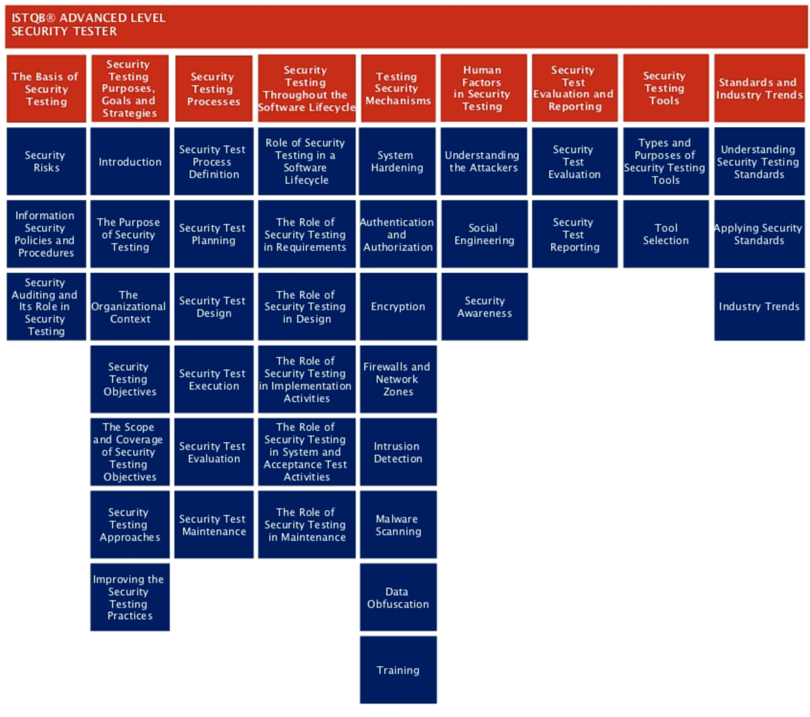

# Adcanced Security Tester syllabus

Security Testing Purposes, Goals and Strategies - 130 mins......................................................... 26
2.1 Introduction.............................................................................................................................. 27
2.2 The Purpose of Security Testing ............................................................................................. 27
2.3 The Organizational Context..................................................................................................... 28
2.4 Security Testing Objectives..................................................................................................... 28
2.4.1 The Alignment of Security Testing Goals ............................................................................ 28
2.4.2 Identification of Security Test Objectives ........................................................................... 28
2.4.3 The Difference Between Information Assurance and Security Testing ............................... 29
2.5 The Scope and Coverage of Security Testing Objectives....................................................... 29
2.6 Security Testing Approaches .................................................................................................. 29
2.6.1 Analysis of Security Test Approaches................................................................................ 29
2.6.2 Analysis of Failures in Security Test Approaches............................................................ 30
2.6.3 Stakeholder Identification ................................................................................................... 31
2.7 Improving the Security Testing Practices ................................................................................ 31

Security Testing Processes - 140 mins............................................................................................. 32
3.1 Security Test Process Definition ............................................................................................ 33
3.1.1 ISTQB Security Testing Process ..................................................................................... 33
3.1.2 Aligning the Security Testing Process to a Particular Application Lifecycle Model.......... 35

→ 特定のアプリケーションのライフサイクルに合わせてプロセスを調整する

3.2 Security Test Planning ........................................................................................................... 38
3.2.1 Security Test Planning Objectives...................................................................................... 38
3.2.2 Key Security Test Plan Elements..................................................................................... 38
3.3 Security Test Design ............................................................................................................... 39
3.3.1 Security Test Design ........................................................................................................... 40
3.3.2 Security Test Design Based on Policies and Procedures ................................................... 44

3.4 Security Test Execution.......................................................................................................... 45
3.4.1 Key Elements and Characteristics of an Effective Security Test Environment .................. 45
3.4.2 The Importance Of Planning and Approvals in Security Testing....................................... 46
3.5 Security Test Evaluation.......................................................................................................... 46
3.6 Security Test Maintenance...................................................................................................... 47

→ 新しいリスクの発見やツールの登場のよりプロセスは見直す必要があるため変更しやすいプロセスにしておく必要がある

Security Testing Throughout the Software Lifecycle - 225 mins...................................................... 48
4.1 The Role of Security Testing in a Software Lifecycle .............................................................. 49
4.1.1 The Lifecycle View of Security Testing............................................................................... 49
4.1.2 Security-Related Activities in the Software Lifecycle.......................................................... 49
4.2 The Role of Security Testing in Requirements........................................................................ 52
4.3 The Role of Security Testing in Design ................................................................................... 53
4.4 The Role of Security Testing in Implementation Activities ...................................................... 53
4.4.1 Security Testing During Component Testing...................................................................... 53
4.4.2 Security Test Design at the Component Level ................................................................... 54
4.4.3 Analysis of Security Tests at the Component Level ........................................................... 54
4.4.4 Security Testing During Component Integration Testing.................................................... 55
4.4.5 Security Test Design at the Component Integration Level ................................................. 55
4.5 The Role of Security Testing in System and Acceptance Test Activities ................................ 56
4.5.1 The Role of Security Testing in System Testing .............................................................. 56
4.5.2 The Role of Security Testing in Acceptance Testing ....................................................... 56
4.6 The Role of Security Testing in Maintenance............................................................................. 56

Testing Security Mechanisms - 240 mins. ....................................................................................... 58
5.1 System Hardening................................................................................................................. 60

→ ITシステムの脆弱性を減らしてセキュリティレベルを向上させること

5.1.1 Understanding System Hardening ................................................................................... 60
5.1.2 Testing the Effectiveness of System Hardening Mechanisms ......................................... 61
5.2 Authentication and Authorization........................................................................................... 61
5.2.1 The Relationship Between Authentication and Authorization .......................................... 61
5.2.2 Testing the Effectiveness of Authentication and Authorization Mechanisms................... 62
5.3 Encryption ............................................................................................................................. 62
5.3.1 Understanding Encryption................................................................................................ 62
5.3.2 Testing the Effectiveness of Common Encryption Mechanisms ...................................... 63
5.4 Firewalls and Network Zones ................................................................................................ 63
5.4.1 Understanding Firewalls .................................................................................................. 63
5.4.2 Testing Firewall Effectiveness ......................................................................................... 64
5.5 Intrusion Detection .................................................................................................................. 64
5.5.1 Understanding Intrusion Detection Tools......................................................................... 64
5.5.2 Testing the Effectiveness of Intrusion Detection Tools .................................................... 65
5.6 Malware Scanning................................................................................................................... 65
5.6.1 Understanding Malware Scanning Tools ......................................................................... 65
5.6.2 Testing the Effectiveness of Malware Scanning Tools .................................................... 65
5.7 Data Obfuscation..................................................................................................................... 66
5.7.1 Understanding Data Obfuscation..................................................................................... 66
5.7.2 Testing the Effectiveness of Data Obfuscation Approaches............................................ 66
5.8 Training .................................................................................................................................. 67
5.8.1 The Importance of Security Training................................................................................ 67
5.8.2 How to Test the Effectiveness of Security Training ......................................................... 67

Human Factors in Security Testing - 105 mins. ............................................................................... 68
6.1 Understanding the Attackers ................................................................................................... 69
6.1.1 The Impact of Human Behavior on Security Risks .......................................................... 69
6.1.2 Understanding the Attacker Mentality .............................................................................. 69
6.1.3 Common Motivations and Sources of Computer System Attacks ................................... 70
6.1.4 Understanding Attack Scenarios and Motivations ........................................................... 70
6.2 Social Engineering .................................................................................................................. 72
6.3 Security Awareness................................................................................................................. 73
6.3.1 The Importance Of Security Awareness .......................................................................... 73
6.3.2 Increasing Security Awareness........................................................................................ 73

Security Test Evaluation and Reporting - 70 mins........................................................................... 74
7.1 Security Test Evaluation.......................................................................................................... 75
7.2 Security Test Reporting........................................................................................................... 75
7.2.1 Confidentiality of Security Test Results ........................................................................... 75

→ テスト結果からシステムの脆弱性がわかってしまう。知る必要がある人にだけ共有すること。

7.2.2 Creating Proper Controls and Data Gathering Mechanisms for Reporting Security Test
Status…........................................................................................................................................ 75
7.2.3 Analyzing Interim Security Test Status Reports............................................................... 75

Security Testing Tools - 55 mins ................................................................................................... 77
8.1 Types and Purposes of Security Testing Tools....................................................................... 78
8.2 Tool Selection.......................................................................................................................... 79
8.2.1 Analyzing and Documenting Security Testing Needs ...................................................... 79
8.2.2 Issues with Open Source Tools ....................................................................................... 79
8.2.3 Evaluating a Tool Vendor’s Capabilities .......................................................................... 80

Standards and Industry Trends - 40 mins...................................................................................... 81
9.1 Understanding Security Testing Standards............................................................................. 82
9.1.1 The Benefits of Using Security Testing Standards .......................................................... 82
9.1.2 Applicability of Standards in Regulatory Versus Contractual Situations .......................... 82
9.1.3 Selection of Security Standards....................................................................................... 82
9.2 Applying Security Standards ................................................................................................... 82
9.3 Industry Trends ....................................................................................................................... 83
9.3.1 Where to Learn of Industry Trends in Information Security ............................................. 83
9.3.2 Evaluating Security Testing Practices for Improvements................................................. 83