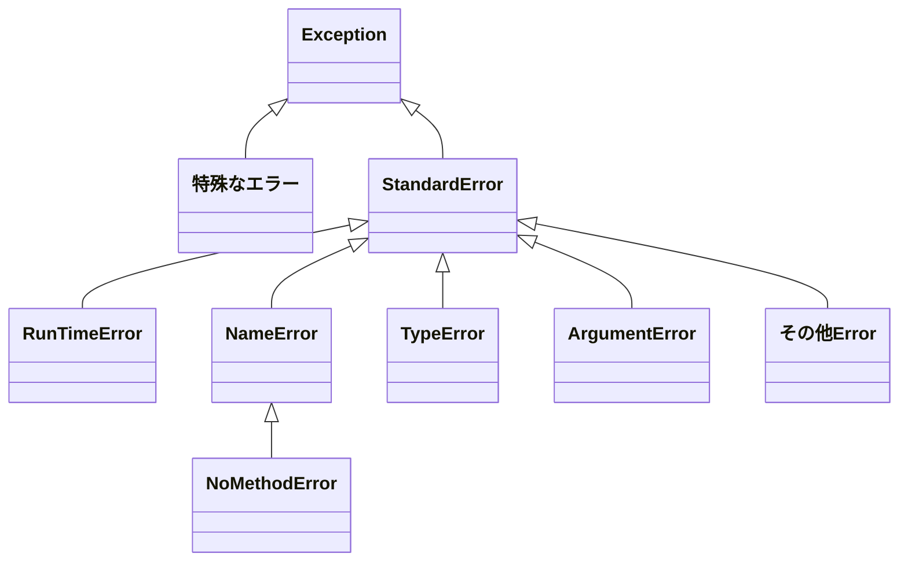

プログラミング言語の再学習として[プロを目指す人のためのRuby入門［改訂2版］](https://gihyo.jp/book/2021/978-4-297-12437-3)を読み始めましたので、気になる点をまとめます。


# 例外時の出力の読み解き方

```
# ruby 2.6.3
irb(main):001:0> 1 + '10'
Traceback (most recent call last):
        5: from /usr/bin/irb:23:in `<main>'
        4: from /usr/bin/irb:23:in `load'
        3: from /Library/Ruby/Gems/2.6.0/gems/irb-1.0.0/exe/irb:11:in `<top (required)>'
        2: from (irb):1
        1: from (irb):1:in `+'
TypeError (String can't be coerced into Integer)
```

``` (String can't be coerced into Integer)```

例外に関するメッセージ

直訳：文字列を整数に変換することはできません

```TypeError```

例外のクラス名

Rubyでは例外クラスのインスタンスになっている

型に関するエラーであることを示している


```
Traceback (most recent call last):
  5: from /usr/bin/irb:23:in `<main>'
  4: from /usr/bin/irb:23:in `load'
  3: from /Library/Ruby/Gems/2.6.0/gems/irb-1.0.0/exe/irb:11:in `<top (required)>'
  2: from (irb):1
  1: from (irb):1:in `+'
```

1 ~ 5まで呼出履歴となっている

# 例外を補足する

```ruby
puts 'Start.'
begin
  1 + '10'
rescue
  puts '例外発生したよ'
end
puts 'End.'
```

```bash
# 実行結果
ruby sample/ruby-book/exeption/sample.rb
Start.
例外発生したよ
End.
```

## 例外オブジェクトから情報取得

```
begin
  1 / 0
rescue => e
  puts "エラークラス: #{e.class}"
  puts "エラーメッセージ: #{e.message}"
  puts "バックトレース: \n#{e.backtrace.reverse.join("\n")}"
end
```

```bash
# 出力
ruby sample/ruby-book/exeption/sample_error_info.rb
エラークラス: ZeroDivisionError
エラーメッセージ: divided by 0
バックトレース:
sample/ruby-book/exeption/sample_error_info.rb:2:in `<main>'
sample/ruby-book/exeption/sample_error_info.rb:2:in `/'
```

## 補足する例外を限定する

```ruby
begin
  1 / 0
rescue ZeroDivisionError
  puts "ゼロで除算したエラー"
end
```

`ZeroDivisionError`は補足されて、例外終了しない
```bash
ruby sample/ruby-book/exeption/sample_restrict_error.rb
ゼロで除算したエラー
```

別の例外クラスのエラーを発生させると捕捉されない
```ruby
begin
  # 定義してないメソッド呼び出しエラーを発生させる
  'abc'.foo
rescue ZeroDivisionError
  puts "ゼロで除算したエラー"
end
```
```bash
ruby sample/ruby-book/exeption/sample_restrict_error_2.rb
Traceback (most recent call last):
sample/ruby-book/exeption/sample_restrict_error_2.rb:3:in `<main>': undefined method `foo' for "abc":String (NoMethodError)
```

### 複数のエラーを補足する

#### 例外クラスによって処理を分ける
```ruby
begin
  # 定義してないメソッド呼び出しエラーを発生させる
  'abc'.foo
rescue ZeroDivisionError
  puts "ゼロで除算したエラーが発生したよ"
rescue NoMethodError
  puts "未定義のメソッド呼び出しエラーが発生したよ"
end
```

#### 同じ処理を呼び出す

```ruby
begin
  # 定義してないメソッド呼び出しエラーを発生させる
  'abc'.foo
rescue ZeroDivisionError, NoMethodError
  puts "ゼロで除算したか、未定義のメソッド呼び出しエラーが発生したよ"
end
```

エラー情報を取得する
```ruby
begin
  # 定義してないメソッド呼び出しエラーを発生させる
  'abc'.foo
rescue ZeroDivisionError, NoMethodError => e
  puts "ゼロで除算したか、未定義のメソッド呼び出しエラーが発生したよ"
  puts "エラー: #{e.class}, #{e.message}"
end
```


# 例外クラスの継承関係

- StandardError # 通常のプログラムで発生しやすいエラーのスーパークラス
- 特殊なエラー（NoMemoryError, SystemExitなど）


rescue節に何も指定しない場合に補足されるのはStandardErrorとそのサブクラスになる

指定した場合はそのクラスとサブクラスが補足される

```ruby
begin
  # 例外
rescue
  # StandardErrorとそのサブクラスのみ補足
end

begin
  # 例外
rescue NameError
  # NoMethodError はここで補足される
rescue NoMethodError
  # ここは永遠に実行されない
end

begin
  # 例外
rescue NoMethodError
  # これなら実行される
rescue NameError
  # NameErrorとそのサブクラスのみ補足
end
```

# retry

たまに書きたくなるので写経しておく
```ruby

retry_count = 0
begin
  puts '処理開始'
  1 / 0
rescue
  retry_count += 1
  if retry_count <= 3
    puts "retry! #{retry_count}回目"
    retry
  else
    puts 'retryに失敗'
  end
end
```

# raise

例外を意図的に発生させるには`raise`を使う

```ruby
raise #=> エラーメッセージを省略できるがあまり良くない
raise '例外が発生しました' #=> RuntimeErrorクラスの例外が発生する
raise ArgumentError.new('引数の例外が発生') # 例外クラスの指定
```


# Best practice

## 安易にrescueを使わない
- 例外が発生した場合、異常終了させて原因を治すべき
- 変に例外をハンドリングしてしまうと内部のデータを壊したりすることもある
- Railsなどではうまくハンドリングする機構がフレームワーク自体の備わっているので委ねるのが良い

## rescueしたら情報を残す

安易に例外を処理するべきはないが必要なことも有る

例えば、100人にメールを送るときに、1人目で例外が発生、異常終了しその後99人に送信されないようなことがあったらこまる

そういうときは例外処理をいれ、できる限りの情報を残すこと

```ruby
users.each do |user|
  begin
    send_mail_to(user)
  rescue =? e
    puts e.full_massage
  end
end
```

## 例外処理は対象範囲と対象クラスを極力絞り込む

```ruby
# Bad
def convert_reiwa_to_date(reiwa_text)
  begin
    m = reiwa_text.match(/令和?<jp_year>\d+)年(?<month>\d+)月(?<day>\d+)日/)
    year = m[:jp_year].to_i + 2018
    month = m[:month].to_i
    day = m[:day].to_i
    Date.new(year, month, day)
  rescue
    # 例外の場合 nil を返却
    nil
  end
end

# Good
def convert_reiwa_to_date(reiwa_text)
  # Beginの外に出す＝例外処理させる範囲を絞る
  m = reiwa_text.match(/令和?<jp_year>\d+)年(?<month>\d+)月(?<day>\d+)日/)
  year = m[:jp_year].to_i + 2018
  month = m[:month].to_i
  day = m[:day].to_i
  begin
    Date.new(year, month, day)
  # rescueする例外クラスも絞る
  rescue ArgmentError
    # 例外の場合 nil を返却
    nil
  end
end
```


## 例外処理よりも条件分岐を使う

例外処理よりもパフォーマンス面でも優れている

```ruby
def convert_reiwa_to_date(reiwa_text)
  # Beginの外に出す＝例外処理させる範囲を絞る
  m = reiwa_text.match(/令和?<jp_year>\d+)年(?<month>\d+)月(?<day>\d+)日/)
  year = m[:jp_year].to_i + 2018
  month = m[:month].to_i
  day = m[:day].to_i
  if Date.valid_date?(year, month, day)
    Date.new(year, month, day)
  end
end
```

## 予期しない条件は異常終了させる

```ruby
# Bad
case country
when :japan
  'yen'
when :us
  'dollar'
else
  'rupee'
end

# Good
case country
when :japan
  'yen'
when :us
  'dollar'
else
  raise ArgumentError, "無効な国名です。#{country}"
end
```

## 例外処理もテストする

# もっと詳しく
## ensure/else

- `encure` : 例外が発生してもしなくても必ず実行させたいときに使う
- `else` : 例外が発生しなかった場合に実行する


```ruby
begin
  # 例外の可能性がある処理

rescue
  # 例外発生時の処理

else
  # 例外が発生しない場合の処理

ensure
  # 例外有無によらず実行する処理

end
```

ただし、`else` を使わずに以下のように実装することができるので、あまり使わない。

`else`を使うと`else` 節中でエラーが発生した場合に、手前の`rescue`で補足されないという違いが有る。

```ruby
begin
  # 例外の可能性がある処理
  # 例外が発生しない場合の処理

rescue
  # 例外発生時の処理

ensure
  # 例外有無によらず実行する処理

end
```

## begin/endを省略するrescue修飾子

`rescue`修飾子を使うと短く記述できる。

StandardErrorとそのサブクラスしか補足できない。（例外クラスの指定ができない）

```ruby
# 前段の式の評価時の例外を補足
1 / 0 recure 0

# より具体的な例

def to_date(string)
  Date.parse(string) rescue nil
end

to_date('2022-09-01')
to_date('hogehoge') #=> nil
```

## $!, $@

`$!`: 最後に発生した例外インスタンス
`$@`: バックトレース情報

可読性を考えると使わないほうが無難


## 例外処理 begin/endを省略

メソッド全体やブロック全体が例外処理で囲まれている場合に省略可能

`{}`で囲うブロックでは不可

```ruby
def fizz_buzz(n)
  begin
    if n % 15 == 0
      'Fizz Buzz'
    elsif n % 3 == 0
      'Fizz'
    elsif n % 5 == 0
      'Buzz'
    else
      n.to_s
    end
  rescue => e
    puts "#{e.class} #{e.message}"
  end
end

def fizz_buzz(n)
  if n % 15 == 0
    'Fizz Buzz'
  elsif n % 3 == 0
    'Fizz'
  elsif n % 5 == 0
    'Buzz'
  else
    n.to_s
  end
rescue => e
  puts "#{e.class} #{e.message}"
end
```

```ruby

users.each do |user|
  begin
    send_mail_to(user)
  rescue => e
    puts e.full_message
  end
end

users.each do |user|
  send_mail_to(user)
rescue => e
  puts e.full_message
end
```

## 補足した例外を再度発生させる

`rescue`節内で`raise`メソッドを使うことができる。

例外を補足し、異常終了前になにか処理をはさみたいときに使える。

```ruby
def fizz_buzz(n)
  begin
    if n % 15 == 0
      'Fizz Buzz'
    elsif n % 3 == 0
      'Fizz'
    elsif n % 5 == 0
      'Buzz'
    else
      n.to_s
    end
  rescue => e
    puts "[LOG]エラーが発生しました。 #{e.class} #{e.message}"
    raise
  end
end
```

## 独自の例外クラスを定義する

```ruby
# 名前だけ変える
class NoCountryError < StandardError
end

# 独自のメソッドや属性を追加する
class NoCountryError < StandardError
  attr_reader :country

  def initialize(message, country)
    @country = country
    super("#{message} #{country}")
  end
end

def currency_of(country)
  case country
  when :japan
    'yen'
  when :us
    'dollar'
  when :india
    'rupee'
  else
    raise NoCountryError.new('無効な国名です', country)
  end
end

begin
  currency_of(:italy)
rescue NoCountryError => e
  puts "#{e.message} #{e.country}"
end
```
